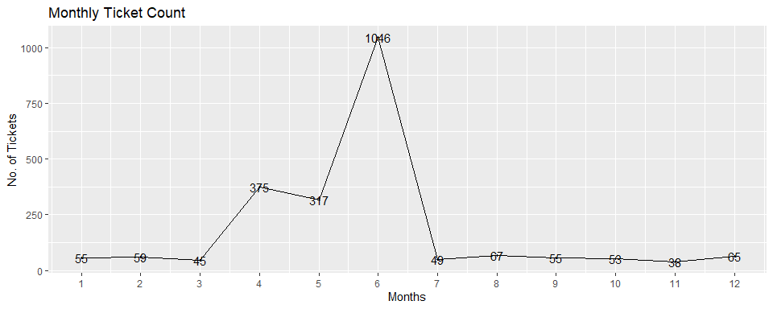
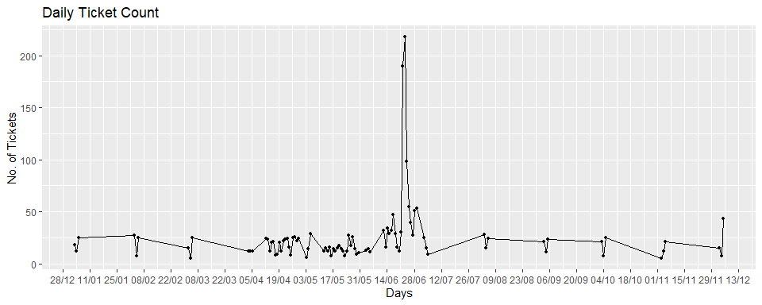

#### Task Need to be performed:
- Importing  data into R environment.
- Provide the trend chart for the number of complaints at monthly and daily granularity levels.
- Provide a table with the frequency of complaint types.
-Which complaint types are maximum i.e., around internet, network issues, or across any other domains.
- Create a new categorical variable with value as Open and Closed. Open & Pending is to be categorized as Open and Closed & Solved is to be categorized as Closed.
- Provide state wise status of complaints in a stacked bar chart. Use the categorized variable from Q3. Provide insights on:
-Which state has the maximum complaints
-Which state has the highest percentage of unresolved complaints
- Provide the percentage of complaints resolved till date, which were received through theInternet and customer care calls.


```r
# Including required Packages
library(stringi)
library(lubridate)
library(dplyr)
library(ggplot2)
```
- Loading Dataset:

```r
comcast_data<- read.csv("Comcast Telecom Complaints data.csv",header = TRUE)
#Manupulating column names
names(comcast_data)<- stri_replace_all(regex =  "\\.",replacement = "",str =names(comcast_data))
head(comcast_data)
```

```
##   Ticket                                                 CustomerComplaint
## 1 250635                                     Comcast Cable Internet Speeds
## 2 223441                      Payment disappear - service got disconnected
## 3 242732                                                 Speed and Service
## 4 277946 Comcast Imposed a New Usage Cap of 300GB that punishes streaming.
## 5 307175                        Comcast not working and no service to boot
## 6 338519          ISP Charging for arbitrary data limits with overage fees
##         Date        Time        ReceivedVia     City    State Zipcode Status
## 1 22-04-2015  3:53:50 PM Customer Care Call Abingdon Maryland   21009 Closed
## 2   4/8/2015 10:22:56 AM           Internet  Acworth  Georgia   30102 Closed
## 3 18-04-2015  9:55:47 AM           Internet  Acworth  Georgia   30101 Closed
## 4   5/7/2015 11:59:35 AM           Internet  Acworth  Georgia   30101   Open
## 5 26-05-2015  1:25:26 PM           Internet  Acworth  Georgia   30101 Solved
## 6  6/12/2015  9:59:40 PM           Internet  Acworth  Georgia   30101 Solved
##   FilingonBehalfofSomeone
## 1                      No
## 2                      No
## 3                     Yes
## 4                     Yes
## 5                      No
## 6                      No
```
Now data is loaded into R, now its available to process further.

- Finding NA`s in dataset:

```r
na_vector <- is.na(comcast_data)
length(na_vector[na_vector==T])
```

```
## [1] 0
```
This shows There is  no missing values in dataset,so now data is tidy and available to process or do EDA based on requriment.

- Processing date.

```r
comcast_data$Date<- dmy(comcast_data$Date)
```
- Extracting monthly and daily 

```r
monthly_count<- summarise(group_by(comcast_data,Month =as.integer(month(Date))),Count = n())
daily_count<- summarise(group_by(comcast_data,Date),Count =n())
monthly_count<-arrange(monthly_count,Month)
#making count of monthly and daily compaints 
```
- Comparing Monthly and daily Complaints 

```r
ggplot(data = monthly_count,aes(Month,Count,label = Count))+
        geom_line()+
        geom_point(size = 0.8)+
        geom_text()+
        scale_x_continuous(breaks = monthly_count$Month)+
        labs(title = "Monthly Ticket Count",x= "Months",y ="No. of Tickets")
```

<!-- -->
As we can see there is a incress in tickets in the month of **April,May** and this also increased in the month of **June**, so there might be some reseon due to that that they recived high amount of tickets.

```r
ggplot(data = daily_count,aes(as.POSIXct(Date),Count))+
        geom_line()+
        geom_point(size = 1)+
        scale_x_datetime(breaks = "2 weeks",date_labels = "%d/%m")+
        labs(title = "Daily Ticket Count",x= "Days",y ="No. of Tickets")
```

<!-- -->
And if we see daily chart of tickets we find that in second half of **June** Month we recived more tickets with respect to normal days.
